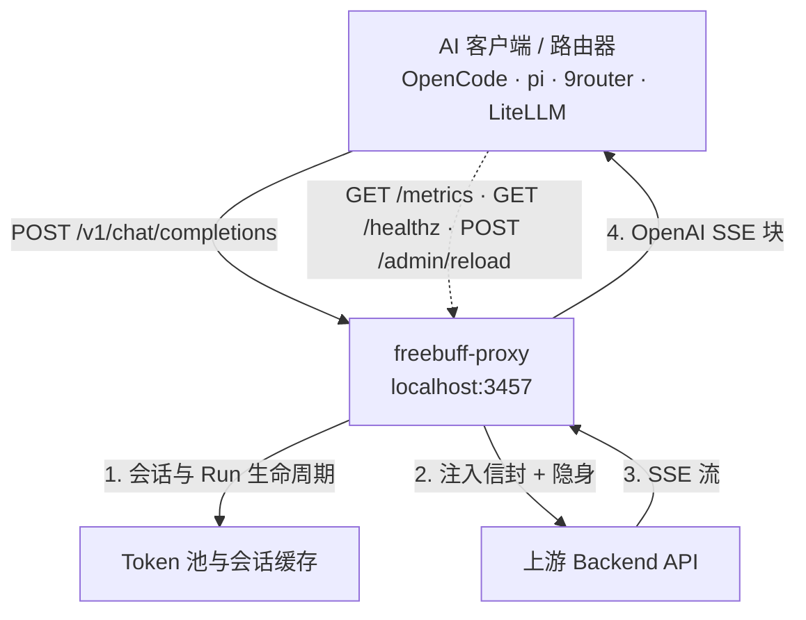

# freebuff-proxy-scaleway：无广告、无 CLI，开箱即得 /v1/chat/completions（Scaleway 一键部署版）

[](https://github.com/trefeon/freebuff-proxy/actions/workflows/ci.yml)
[](https://github.com/trefeon/freebuff-proxy/releases)
[](https://github.com/trefeon/freebuff-proxy/blob/main/LICENSE)

> 本仓库是 [`trefeon/freebuff-proxy`](https://github.com/trefeon/freebuff-proxy) 的 **Scaleway Serverless Containers 最小改动移植版** — 保持全部代理逻辑不变，**2 文件 + 1 工作流** 即可云端运行，推送即自动重建。原逻辑（池化/桥接、会话/Run、隐身、面板）保持字节级一致。

`freebuff-proxy` 是一个本地网关，把 Codebuff/FreeBuff 背后的 AI 编程模型暴露给**任意支持 OpenAI 接口的工具**：OpenCode、pi、9router、LiteLLM 以及你的脚本。

你的工具期望的是标准 OpenAI 端点（`/v1/chat/completions`），而上游不是 OpenAI 形态：它是带自有会话协议的 CLI 编程智能体，免费额度与单账号 token 绑定（每日配额、限流/封禁）。`freebuff-proxy` 夹在中间帮你扛住这些摩擦：

- **翻译**：把标准 OpenAI 请求重写为上游会话协议（CLI 请求信封、模型绑定的 Agent Run、工具 Schema 归一），并把 SSE 原样转回 OpenAI `chat.completion.chunk` 事件流；
- **池化**：在多 token 间路由（热会话优先 + 轮询起步 + 失败切换），让繁忙的客户端/路由器扛过单账号配额；
- **隐身**：让出站看上去像真浏览器（TLS 指纹、头部清洗、请求抖动），降低上游风控标记概率（见下方 ToS 提醒）。

> **⚠️ 服务条款风险。** 用 FreeBuff token 走本代理与 FreeBuff/Codebuff 服务条款冲突；上游风控可能暂停或永久封禁账号。请保持 `SAFE_MODE=true`、用量克制、不要 24/7 无人值守。详见 [快速开始](docs/getting-started.md)。

> **⚠️ 合理预期。** FreeBuff 服务端非常严格，本代理**降低**封号风险，但不能消除。没有任何方案能保证永不被标记/封禁。上游检测已在开源 FreeBuff 客户端中明文体现：按请求 IP 评分（VPN/代理/Tor/机房出口 → 受限档或终局 `country_blocked`）、按账号信任等级的粘性上限（第三方客户端标记、共用注册网络、共用邮箱）、每日消费上限（受限人群 $0.50/天）、以及对已知农场形态的批量横扫（7,129 个一次性邮箱账号中已有 6,699 个被封）。本项目是把 FreeBuff 模型以 OpenAI 兼容 API 暴露给其他编程智能体（OpenCode、pi、hermes、openclaw 及任意支持自定义端点的客户端）的本地适配器；凭证由网关自动托管，线协议为官方 CLI 的近 99% 复刻；它不是官方客户端，上游变更可能导致暂时不可用直至适配。保持克制并遵守下方的卫生守则；会话处理与风控规避仍在持续改进中。

---

## 目录

- [30 秒快速开始（Scaleway 云端）](#scaleway-云端一键部署)
- [30 秒快速开始（本地）](#新手从这里开始30秒快速开始)
- [系统要求](#系统要求)
- [功能特性](#功能特性)
- [工作原理](#工作原理)
- [核心概念](#核心概念)
- [快速开始（本地完整版）](#快速开始)
- [命令行](#命令行)
- [配置参考](#配置参考)
- [部署](#部署)
- [使用指南](#使用指南)
- [贡献与安全](#贡献与安全)
- [联系与支持](#联系与支持)
- [许可证](#许可证)

---

## Scaleway 云端一键部署（推荐）

> **本分支专属：推送即自动重建，无需本地 Go 环境。**

### 只需 3 个环境变量

| 变量 | 作用 | 在 Scaleway 填为 Secrets |
|------|------|---------------------------|
| `FREEBUFF_TOKEN`（或 `AUTH_TOKENS`） | FreeBuff 上游凭证 `cb_...`，多账号用英文逗号分隔 | `Secrets → + Add secret` |
| `API_KEY`（或 `API_KEYS`） | 对外代理密钥，客户端 `Authorization: Bearer <此值>` | `Secrets` |
| `ADMIN_TOKEN`（或 `ADMIN_PASSWORD`） | `/admin` 控制台与 `POST /admin/reload` 密码 | `Secrets` |

`PORT` 由 Scaleway 平台自动注入 `8080`，无需手动配置（本分支 `Dockerfile:23` 与 `internal/config/config_env.go:32` 已做回退 `LISTEN_ADDR=:$PORT`）。

### 控制台 5 分钟

1. **创建镜像仓库**：Scaleway 控制台 → `Container Registry → Create namespace`，Region 选 `PAR`（`fr-par`），命名 `freebuff`，`Private`。
2. **先推送镜像（否则下一步 `Image*` 必选但为空，无法提交）**——二选一：
   - **本机推送（最快）**：于本仓库根执行
     ```bash
     docker login rg.fr-par.scw.cloud -u nologin --password-stdin <<< "$SCW_SECRET_KEY"
     docker build -t rg.fr-par.scw.cloud/freebuff/freebuff-proxy:latest .
     docker push rg.fr-par.scw.cloud/freebuff/freebuff-proxy:latest
     ```
   - **用 GitHub 工作流推送**：先在 GitHub `Settings → Secrets → Actions` 填 `SCW_SECRET_KEY` + `SCW_REGISTRY_ENDPOINT=rg.fr-par.scw.cloud/freebuff`（`SCW_CONTAINER_ID` 留空），再 `Actions → Deploy to Scaleway Containers → Run workflow`，待绿勾
3. **部署容器**（此时截图的 `Image*` 才可选择）：
   - 源选 **Scaleway Images from your Scaleway Container Registry**（第一项）
   - `Registry region` 选 `PAR`，`Registry namespace` 选 `freebuff`，`Image` 选 `freebuff-proxy` / `Tag` `latest`
   - `Port` **保持 `8080`**（勿改 3457）
   - `Container name` 填 `freebuff-proxy`
   - `Resources` **改小：CPU 500 mVCPU / Memory 512 MB**（图中 1000/2048 偏大，256MB/140mCPU 亦可）
   - `Autoscaling` → `Request concurrency`：**minimum 0, maximum 3, concurrent 80**（`0` 实现 scale-to-zero，空闲 €0）
   - `Advanced → Secrets → + Add secret` 加上述 **3 行**，`Environment variables` 无需额外变量
   - 点 `Deploy container`，记下 `Container ID` 与 `Endpoint`（如 `https://freebuff-proxy-xxxxx.containers.par.scw.cloud`）
4. **补齐 GitHub Secrets 以实现后续推送即重部署**：回 GitHub `Settings → Secrets` 追加 `SCW_CONTAINER_ID`（上一步 UUID）与 `SCW_REGION=fr-par`；此后 `git push origin main` 即自动 `docker login → build linux/amd64 → push → PATCH + /redeploy`（见 `.github/workflows/scaleway.yml:1`）

> **是否免费？是 — 额度内 €0。** Containers 免费额度**按账户每月**：**400,000 GB·s + 200,000 vCPU·s**（内存/算力，临时盘与出入流量免费）；`min_scale=0` 时空闲不计费。个人代理（512MB/500mCPU，3s/次）：月 30k 请求≈45k GB·s → **€0**；100k→€0；300k→约 €0.12。截图右侧 €18 为**未扣免费额度前的估算**，黑浮层提示 “This estimate does not take into account the free tier…” 即此意。
> - 自查：`Billing → Cost Manager` 筛 `Serverless Containers` 看 `Free Tier` 抵扣；`Billing → Invoices` 当月 `Free Tier` 块；`Billing alerts` 设 €1/€5 告警。
> - **机房出口注意**：Scaleway 巴黎/阿姆斯特丹为机房 IP，MaxMind/Spur 识别为 `hosting/vpn` → 只给 `limited` 档（可用模型仅 `mimo/mimo-v2.5`），非计费问题，`SAFE_MODE=true` 缓解。

详尽截图填表与算例见 [`docs/scaleway-containers.md`](docs/scaleway-containers.md)；完整移植说明见 `skill.md` 与 `.opencode/skills/freebuff-proxy-scaleway/SKILL.md`。

---

## 新手从这里开始（30 秒快速开始）

Freebuff-proxy 把 FreeBuff/Codebuff CLI 背后的免费 AI 模型暴露给任意 OpenAI 兼容工具（Cursor、VS Code Continue/Cline、OpenCode、pi、9router、Chatbox、LibreChat）。

零代码起步：

1. **下载 Releases 预编译包**：前往 [**Releases**](https://github.com/trefeon/freebuff-proxy/releases) 下载对应系统 ZIP（如 `freebuff-proxy_..._windows_amd64.zip`）。*（不要点绿色的 “Code -> Download ZIP”，那是源码）*
2. **解压并双击**：解压文件夹。
   - **Windows**：双击 `start-proxy.cmd`。
   - **Linux / macOS**：在解压目录打开终端执行 `./start-proxy.sh`。
3. **登录**：按回车在浏览器中用 FreeBuff/GitHub 登录，token 自动保存！
4. **打开网页控制台**：浏览器访问 [**http://localhost:3457/admin**](http://localhost:3457/admin) 查看实时状态、发起测试对话、可视化管理 token。
5. **接入你的工具**：在 Cursor、VS Code Continue/Cline、Chatbox 或 OpenCode 中配置：
   - **Base URL**：`http://localhost:3457/v1`
   - **API Key**：`not-needed`
   - **Model**：`deepseek/deepseek-v4-flash`（仅满血档；受限账号自动降为 `mimo/mimo-v2.5`）
   *（一键配置片段见 [客户端接入指南](docs/client-integration.md)）*

**开始前的规矩（该做 / 不该做）：**

| ✅ 该做 | ❌ 不该做 |
|---|---|
| **用完一个 key 再换**；池子会自然耗尽它 | **不要轮着换一堆健康 key**；像养号农场 |
| 用**正常家宽网络** | **不要用 VPN / 代理 / Tor**（Cloudflare L4 GeoIP + MaxMind/Spur ASN 检测 → 受限或 `country_blocked`） |
| 用**真实邮箱**注册（如 Gmail） | **不要用一次性邮箱**（已证实封号群：7,129 账号中 6,699 已封） |
| **只请求你档位/地区可用模型**（默认 Flash） | **不要请求跨区模型**：被拒/降级且与出口 IP 地理强相关 |
| 把 `429` 读作**配额，太平洋午夜重置** | **不要把配额当封号**；只有 `403` 的 `banned`/`country_blocked` 才是终局 |
| 预期**降低**而非免疫 | **不要 24/7 无人值守**期望零风险 |
| 保持**一次只用一个 key** | **不要在同一公网 IP 下猛刷多 token**（会 `ip_capped`） |

**访问档位与上游模型。** FreeBuff 通过 Cloudflare 的 TCP 层 GeoIP 判定档位（非 HTTP 头，无法伪造）。位于 Tier-1 国家的家宽 IP（美、英、德、日、加等）为 `accessTier: "full"`，全部高级模型可用（**基础 5 premium 会话/天**）。非 Tier-1 国家 IP 为  `accessTier: "limited"`，唯一可用模型为 `mimo/mimo-v2.5`（MiMo 2.5）。

> **📢 官网上游公告**（厂商快照 2026-08-23）：
> *“GPT-5.6 Luna 为每天 3 次会话；V4 Pro 与 Flash 共用每日会话；MiMo 不计入配额。—❤️ Freebuff 团队”*
> （DeepSeek 模型在工作日高峰时段不可用；北京周末周六/日始终为非高峰。）

| 类别 | 模型名 | 线上模型 ID | 规格与上游配额策略 |
|---|---|---|---|
| **Premium** | **DeepSeek V4 Flash 07/31** *(推荐)* | `deepseek/deepseek-v4-flash` | **聪明且快**，推理：`high`，`NEW`。5 会话/天 premium 池 |
| **Premium** | **GPT-5.6 Luna** | `openai/gpt-5.6-luna` | **全能**，推理：`high`，支持图像。**3 会话/天限制**（厂商快照 8.21–8.23 从 1→2→3 上调） |
| **Premium** | **DeepSeek V4 Pro** | `deepseek/deepseek-v4-pro` | **深度推理**，推理：`high`。上游已取消单模型上限（8.23 快照）—— 共用每日 premium 池；工作日高峰暂停已解除 |
| **不限量**| **MiMo 2.5** | `mimo/mimo-v2.5` | **均衡**，支持图像。**全档位不限量** |
| **邀请制** | **GLM 5.2** | `z-ai/glm-5.2` | **顶尖开源智能体模型**。邀请门槛（每邀请+1 会话） |
| **已下线** | **MiniMax M3** | `minimax/minimax-m3` | 因服务端成本激增暂不可用 |

完整细节见 [关键卫生与风控规避](#关键卫生与风控规避)。

向导式 5 分钟教程见 [快速开始](docs/getting-started.md)。

## 系统要求

| 要求 | 说明 |
|---|---|
| **FreeBuff/Codebuff 账号** | 在 codebuff.com / freebuff.com 注册免费账号，每个账号有独立的每日会话配额 |
| **Token（`cb_...`）** | 来自官方 CLI 登录或 `scripts/gen-token.*`，见 [获取 Auth Token](#2-获取-auth-token) |
| **操作系统** | Linux、macOS 或 Windows（amd64/arm64），提供预编译 Release，无需 Go 工具链 |
| **Docker** | 可选：仅容器部署路径（`docker compose up -d --build`） |
| **网络** | 出站 HTTPS 到 `codebuff.com`（可经 `UPSTREAM_BASE_URL` 改写）；代理默认监听回环 `127.0.0.1:3457`，容器/云端为 `0.0.0.0:$PORT` |
| **Go 1.26+** | 仅源码编译需要 |

---

## 功能特性

- **OpenAI 兼容 API**：`POST /v1/chat/completions`（流式/非流式）、`POST /v1/responses`、`POST /v1/messages`（Anthropic 形态）+ `/v1/messages/count_tokens`、`POST /v1/embeddings`（不支持 → `400 unsupported_endpoint`）、`GET /v1/models`、`GET /healthz`、Prometheus `GET /metrics`、热重载 `POST /admin/reload`。
- **管理面板**：单二进制内嵌 Web UI 位于 `http://<host>:3457/admin`：基于 **Svelte 5 + Tailwind CSS v4** 的现代单页应用，内置 **IBM Plex Sans & IBM Plex Mono** 字体与“仪表盘”运营设计。涵盖实时总览（6 KPI + token 风险卡）、运行时 token 池与配额管理（含浏览器内 OAuth 设备登录）、已服务模型目录、支持热重载的 `.env` 配置工坊、内存结构化日志查看器（级别过滤）与通用一键客户端接入片段。零外部 CDN、零运行时 Node.js 依赖。
- **动态推理强度**：OpenAI `reasoning_effort`（`low`/`medium`/`high`/`max`）与 Codex/Anthropic `reasoning.effort` 归一并映射到上游推理引擎。
- **会话与 Run 生命周期**：上游会话握手、模型锁恢复（`DELETE` → 重 `POST`）、优雅排空与空闲 Run 回收，全自动。
- **Token 池化与桥接模式**：热会话优先的跨 `AUTH_TOKENS` 池化与轮询起步/失败切换，或零存储透传（客户端自带 token）。详见 [核心概念](#核心概念)。
- **Token 自动发现**：`AUTH_TOKENS` 为空时从官方 CLI 登录文件（`~/.config/manicode/credentials.json`、`~/.config/codebuff/credentials.json`）读取；`AUTO_DISCOVER_TOKEN=false` 可关闭。
- **TLS 隐身**：基于 uTLS 的浏览器 TLS 指纹（Chrome、Firefox、Safari、Edge）+ 请求头清洗，使出站看上去像浏览器客户端。
- **CLI 伪装**：出站伪装为官方 FreeBuff CLI——广告 API `Freebuff-CLI/1.0.0` + `Chrome/124` 的 body UA，聊天请求 `ai-sdk/openai-compatible/1.0.0/codebuff`，会话/鉴权端点 `Bun/1.3.14`，并带上真实的设备时区/语言。
- **子智能体并发就绪**：单飞（singleflight）会话刷新，避免高频工具调用循环中的竞态。
- **安全模式**：默认开启的反封预设（TLS 隐身、头部清洗、抖动、空闲轮换）。
- **运维工具**：`-doctor` 诊断（配置、端口、DNS/TLS、registry；默认每 token 零成本可用性探测）、`-test-token`（零成本探测首 token，打印实时配额，`0/1` 退出码便于脚本）、`-setup` 交互式客户端配置，以及经 SHA-256 校验的 `-update` 自更新。
- **配额透视**：来自上游 `rateLimitsByModel` 准入载荷的实时分模型配额在 `GET /healthz`（每 token `quota` 映射）与 `GET /metrics`（`freebuff_proxy_quota_recent` / `freebuff_proxy_quota_limit`）中透出。

## 工作原理

一次聊天请求的端到端：

1. **你的工具调用代理。** 以标准 OpenAI 请求 `POST http://127.0.0.1:3457/v1/chat/completions` 打到代理，形态与打任意 OpenAI 兼容端点一致。
2. **挑选 token。** 代理优先复用已持有活跃会话的 token（热会话优先），从轮询下标起跳，跳过处于冷却或被限流锁定的 token；桥接模式则使用客户端在 `Authorization` 头里带来的 token。
3. **请求被翻译。** 模型 ID 经目录解析到上游实际执行的 Agent，消息列表被清洗并重包为 CLI 请求信封，OpenAI 特有参数（`reasoning_effort`、工具 Schema 等）映射为上游期望。
4. **隐身发出。** 上游调用使用类浏览器 TLS 握手与清洗后的头部。
5. **流式回传并翻译。** 上游 SSE 流被转换为 OpenAI `chat.completion.chunk` 事件实时中继给客户端。
6. **状态清理。** 请求结束后 Run 被排空；Run/Token 超过存活期（轮换间隔、空闲超时）则轮换/结束，保证下一请求干净。命中配额 `429` 的 token 在本地按重置时间锁定，代理在 `<1ms` 内直接回 `429` + `Retry-After`，不再向上游发流量。

翻译层复刻了官方 CLI 的线协议与会话生命周期，源自开源 Freebuff 客户端（Apache-2.0），随上游变化而变化。翻译实现位于 `internal/convert`、`internal/upstream`、`internal/stealth` 与 `internal/registry`。



## 核心概念

| 概念 | 含义 |
|---|---|
| **Token** | 一个 FreeBuff/Codebuff 账号凭证（`cb_...`），各自有独立每日配额、独立限流/封禁 |
| **Session** | 每 token 的上游准入态（握手、模型锁），代理维护并复用，避免每请求都付握手成本 |
| **Run** | 某模型的一次上游 Agent 执行，多请求共享；首用时创建，存活 `ROTATION_INTERVAL`（默认 `6h`）后轮换（新起旧排空/结束），避免单 Run 异常长期存活；空闲 token 的 Run 也会被结束 |
| **Model** | 目录条目，写作 `provider/model`（如 `deepseek/deepseek-v4-flash`），registry 提供 `/v1/models` 并把模型映射到实际执行它的上游 Agent |
| **池化模式** | 在 `AUTH_TOKENS` 中配置多 token；请求粘在持有活跃会话的 token 上，仅在配额或异常时才被动切换：被动排空，而非激进轮换。适合单用户多账号追求最大可用与配额余量 |
| **桥接模式** | 不配 token；每客户端以 `Authorization: Bearer <token>` 自带凭证，代理以其透传并做 LRU 缓存（最多 32）。适合共享路由器（如 9router）服务多用户各带各号 |
| **安全模式** | 默认开启的反封预设：TLS 隐身、代理头清洗、请求抖动与空闲轮换。见 [安全模式](#安全模式与零垃圾配额处理) |
| **配额锁** | 当 token 命中每日上限，代理解析上游 `429` 的重置时间并在本地拒绝该 token 后续请求，快（`<1ms`）、静默、无垃圾流量 |

---

## 快速开始

### 1. 安装

**一键安装脚本（Linux/macOS）：**

```bash
curl -sSL https://raw.githubusercontent.com/trefeon/freebuff-proxy/main/scripts/install-freebuff-proxy.sh | bash
```

**Windows（PowerShell）：**

```powershell
irm https://raw.githubusercontent.com/trefeon/freebuff-proxy/main/scripts/install-freebuff-proxy.ps1 | iex
```

Bash 安装脚本会询问安装方式（简易、手动二进制、Docker Compose、桥接模式）；两者都会创建/读取 token 并写入 `.env`。

**或用 Docker Compose：**

```bash
cp .env.example .env   # 然后设置 AUTH_TOKENS
git fetch --tags 2>/dev/null || true
VERSION=$(git describe --tags 2>/dev/null || echo dev) docker compose up -d --build
```

**或下载 Release 二进制**：前往 [Releases](https://github.com/trefeon/freebuff-proxy/releases)（Linux/macOS/Windows × amd64/arm64），解压后右键打开终端执行 `./start-proxy.sh`（Windows：`.\start-proxy.cmd`；`.cmd` 可绕过 PowerShell 执行策略）。附带无头 token 生成器（`gen-token.sh` / `gen-token.cmd`）。

### 2. 获取 Auth Token

无头生成（自动打开浏览器 OAuth 登录）。不带参数运行进入交互菜单；推荐默认（回车）追加 token 到 `.env`（若缺失则从 `.env.example` 自动创建）：

**Windows（PowerShell / CMD）：**

```powershell
.\scripts\gen-token.cmd            # 菜单；回车 = 追加到 .env（自动创建）
```

**Linux / macOS（bash）：**

```bash
./scripts/gen-token.sh             # 菜单；回车 = 追加到 .env（自动创建）
```

`gen-token.*` 还支持跳过菜单的显式模式：`--clipboard` / `-ToClipboard`、`--save` / `-Save`（存到 CLI 凭证文件）、`--append` / `-Append`（追加到 `.env` 的 `AUTH_TOKENS`）、`--env <path>` / `-EnvFile <path>`。

也可先用官方 CLI 登录（`npm i -g freebuff && freebuff`）：启动时代理会自动从其凭证文件发现 token。

### 3. 配置

拷贝示例并设置 token：

```bash
cp .env.example .env
# AUTH_TOKENS=cb_xxx        ← 粘贴你的 token（多账号用逗号分隔）
# SAFE_MODE=true            ← 默认（设为 false 关闭）
# 云端（本分支）：也支持 FREEBUFF_TOKEN / API_KEY / ADMIN_TOKEN 三变量别名
```

`AUTH_TOKENS=` 留空即为**桥接模式**（客户端自带 token）。不确定选哪种？单用户多账号 → 池化；共享路由器多用户 → 桥接。见 [核心概念](#核心概念)。`config.example.json` 以 JSON 形式展示常用键，由 `-config` 加载；全部键详见下方 [配置参考](#配置参考)。其中的 `cb_xxx`/`cb_yyy` 占位符会被校验拒绝——使用真实 token 再传 `-config`。

### 4. 运行与验证

```bash
./freebuff-proxy            # 或：docker compose up -d
```

健康检查与诊断：

```bash
curl http://127.0.0.1:3457/healthz
./freebuff-proxy -doctor        # 配置、端口、DNS/TLS、registry，外加每 token 的零成本可用性探测
./freebuff-proxy -test-token    # 对首 token 的零成本上游 GET 探测（不占会话）；打印实时配额，0/1 退出码供脚本
# 云端验证（Scaleway）
curl https://<你的容器>.containers.par.scw.cloud/healthz
curl https://<你的容器>.containers.par.scw.cloud/v1/models -H "Authorization: Bearer <API_KEY>"
```

---

## 命令行

| 标识 | 说明 |
|---|---|
| *(无)* | 启动代理 |
| `-config <路径>` | 加载可选 JSON 配置文件（键名与环境变量同名） |
| `-v` | 详细（debug）日志 |
| `-version` | 打印版本后退出 |
| `-doctor` | 运行环境与配置诊断：配置、端口、DNS/TLS 可达性、模型 registry，外加每 token 的零成本探测 |
| `-test-token` | 以零成本 GET 探测首个已配 token（不占会话）；打印 `token OK` 与实时配额，`0/1` 退出码 |
| `-update` | 从最新 GitHub Release 自更新（对 `checksums.txt` 做 SHA-256 校验） |
| `-setup` | 交互式客户端配置（探测已装客户端） |
| `-yes` | 自动确认 `-setup` 提示 |
| `-refresh-token N` | 在 `.env` 中对第 N 个 token 走无头 GitHub 登录重认证后退出；交互式：打印登录 URL 并轮询；配合 `-yes` 且设 `GITHUB_USER` / `GITHUB_PASSWORD` / `GITHUB_TOTP` 时走协议登录 |
| `-install-service` | 将当前二进制注册为后台服务并启动：Windows 任务计划（按用户，无需管理员）、Linux `systemd --user`、macOS `launchd LaunchAgent`；从可执行文件所在目录运行以保证 `.env` 解析，并开机自启 |
| `-uninstall-service` | 停止并注销后台服务（幂等） |
| `-service-status` | 检查服务是否已注册并运行；已注册退出 `0`，否则 `1`（可脚本化） |

---

## 配置参考

所有键均可通过环境变量或传给 `-config` 的 JSON 配置文件设定（`AUTO_DISCOVER_TOKEN` 仅环境变量）；若存在本地 `.env` 文件也会被读取，对其覆盖的键表现如环境变量。优先级由低到高：**内置默认值 < JSON `-config` < `./.env` < 环境变量**。列表值（`AUTH_TOKENS`、`API_KEYS`、`MODELS_ALLOW`）在 env 中为逗号分隔，在 JSON 中为数组（`MODELS_ALLOW` 在 JSON 中也接受逗号分隔字符串）。

> **本分支 Scaleway 别名**：`FREEBUFF_TOKEN`/`FREEBUFF_TOKENS`/`TOKEN` → `AUTH_TOKENS`；`API_KEY`/`FREEBUFF_API_KEY`/`PROXY_API_KEY` → `API_KEYS`；`ADMIN_PASSWORD` → `ADMIN_TOKEN`；`PORT=8080` 时若 `LISTEN_ADDR` 为默认回环则自动回退为 `:$PORT`（见 `internal/config/config_env.go:32`）。

| 环境变量 | 默认值 | 说明 |
|---|---|---|
| `LISTEN_ADDR` | `127.0.0.1:3457` | 监听地址与端口（本地回环；容器/云端设 `:3457` 或留空由 `$PORT` 回退） |
| `UPSTREAM_BASE_URL` | `https://codebuff.com` | 上游 API 端点（归一为 `www.codebuff.com`） |
| `AUTH_TOKENS` | `""` | 逗号分隔的上游 token（空 = 桥接模式；本分支也接受 `FREEBUFF_TOKEN` 等别名） |
| `MODELS_HIDE_UNAVAILABLE` | `false` | `/v1/models` 是否剔除被标记不可用的模型（地区/档位降级、配额耗尽），默认关闭以免误隐藏 |
| `MODELS_ALLOW` | `""` | 逗号分隔的模型白名单（JSON 数组或字符串）；设置后仅服务这些解析后的模型 ID，其它模型请求以 `404 model_not_found` 拒绝 |
| `AUTO_DISCOVER_TOKEN` | `true` | `AUTH_TOKENS` 为空时是否从官方 CLI 登录文件读取（`false` 关闭） |
| `API_KEYS` | `""` | 逗号分隔的客户端密钥，`openai` 兼容端点鉴权（空 = 开放；桥接下忽略；本分支也接受 `API_KEY` 等） |
| `ADMIN_TOKEN` | `123456` | [管理面板](#管理面板) 登录密码与 `POST /admin/reload` 的 bearer；默认为出厂口令 `123456`（启动警告且面板横幅提示改密）：**暴露端口前务必修改**——出厂口令生效时敏感面板路由另需回环客户端 |
| `ROTATION_INTERVAL` | `6h` | Agent Run 轮换间隔 |
| `REQUEST_TIMEOUT` | `15m` | 上游请求超时 |
| `SESSION_CALL_TIMEOUT` | `30s` | 会话调用超时 |
| `REGISTRY_REFRESH` | `6h` | 模型目录刷新间隔 |
| `COST_MODE` | `free` | `free`（免费档）或付费计费模式 |
| `ACTING_USER_ID` | `""` | 可选 FreeBuff 账号 ID；每次聊天以 `x-freebuff-acting-user-id` 发送。封号风险：仅 token 自身账号 ID 安全（CLI 由 `GET /api/v1/me` 派生；服务端仅对 FreeBuff Web 服务账号信任该头），其它值属伪装。旧名 `USER_ID` 仍兼容，空 = 不发 |
| `TLS_FINGERPRINT` | `auto` | `auto`、`chrome120`、`chrome126`、`safari17`、`safari18`、`firefox120`、`firefox128`、`edge126`、`random` |
| `DEBUG_DUMP` | `false` | 以脱敏方式把流量落盘到 `./dump/`（0600） |
| `LOG_FILE` | `""` | 追加日志到文件（如 `./logs/proxy.log`） |
| `LOG_LEVEL` | `info` | `debug`、`info`、`warn`、`error`、`trace`（trace = 线级 body） |
| `LOG_FORMAT` | `text` | `text`（key=value，彩色）或 `json`（每行一 JSON） |
| `LOG_ACCESS` | `true` | 每 HTTP 请求打印一条 `access` 日志行（`false` 关闭；`/healthz`、`/metrics`、OPTIONS 仍限 1/分） |
| `LOG_RING_SIZE` | `500` | `/admin/logs` 的内存环大小（50–5000） |
| `MAX_MESSAGES_PER_DAY` | `0` | 每 token 每日成功聊天上限（`0` = 不限，默认；上游 `429` 锁为真实约束） |
| `IDLE_ROTATION_TIMEOUT` | `0` | 空闲后结束 Run 的时长（`0` = 关闭；`SAFE_MODE` 未设时给 30m） |
| `SESSION_IDLE_END` | `0` | 空闲后结束上游会话的时长，释放 token 的每日准入位，下一请求重准入并消耗新位（`0` = 关闭， opt-in） |
| `QUOTA_FALLBACK_MODELS` | `flash→mimo, glm→flash, luna→flash` | 某模型会话配额耗尽/无权时的映射回退。默认：`deepseek/deepseek-v4-flash=mimo/mimo-v2.5`、`z-ai/glm-5.2=deepseek/deepseek-v4-flash`、`openai/gpt-5.6-luna=deepseek/deepseek-v4-flash`（luna 在本地降级，避免对稀缺 1/天的会话猛刷 429；#203） |
| `SAFE_MODE` | `true` | 应用反封预设（见下；设 `false` 关闭） |
| `REQUEST_JITTER` | `0s` | 每次上游聊天前的随机延迟区间 `[0, REQUEST_JITTER)`（`SAFE_MODE` 未设时给 2s） |
| `CLI_VERSION` | `0.10.7` | 仅信息性：解析后展示于管理面板（配置工坊）；无线上影响——聊天 UA 固定为 `ai-sdk/openai-compatible/1.0.0/codebuff`，广告 UA 为 `Freebuff-CLI/1.0.0`，会话/鉴权端点为 `Bun/1.3.14` |
| `MODEL_ALIASES` | `""` | 模型别名映射，如 `gpt-4o:deepseek/deepseek-v4-pro`。未设或为空/解析为空时应用内置：`deepseek-chat` → `deepseek/deepseek-v4-flash`、`gpt-4o` → `deepseek/deepseek-v4-pro`、`claude-3-5-sonnet` → `anthropic/claude-fable-5`；非空且含 ≥1 有效对时完全替换默认 |
| `TRANSIENT_RETRIES` | `1` | 瞬时传输失败后的最多追加重试次数；`0` 关闭 |
| `SESSION_PERSIST` | `false` | 持久化会话态与活跃 Agent Run 到磁盘，重启后续联而非重建（新日位 / 重 START） |
| `SESSION_STATE_FILE` | `.freebuff-session-state.json` | 会话态文件路径（`SESSION_PERSIST=true` 时使用；按 token 哈希，`0600`） |
| `SESSION_RE_ADMIT_LEAD` | `60s` | 剩余该时长前预先重准入：当次请求走旧会话异步刷新，下一请求拿新实例 |
| `SESSION_PROBE_CACHE_TTL` | `15s` | 复用上次成功会话态（跳过冗余会话轮询 GET）的窗口 |
| `SESSION_CREATE_MAX_PARALLEL_GLOBAL` | `128` | 并发在途会话准入数上限（等待或 503） |
| `SESSION_CREATE_MAX_PARALLEL_PER_MODEL` | `32` | 每模型并发在途会话准入数上限 |
| `RUN_FINISH_QUEUE_SIZE` | `64` | 有界延迟 FINISH 工作队列的容量（被轮换/排空的 Run） |
| `RUN_FINISH_INLINE_TIMEOUT` | `250ms` | 队列满时同步内联 FINISH 的超时界 |
| `RUNS_DRAIN_QUEUE_CAP` | `64` | 排空 Run 列表上限；超限老条目被强行丢弃（FINISH 尽力而为） |
| `RUNS_DRAIN_TTL` | `10m` | 排空 Run 的 TTL 驱逐窗口 |
| `HTTP2_UPSTREAM` | `true` | 与上游协商 HTTP/2，使 ALPN 与真浏览器一致；`false` 强制 HTTP/1.1 |
| `FALLBACK_MODEL` | `""` | 映射 `model1=fallback1,model2=fallback2`，当队列等待达到 `FALLBACK_AFTER_MS` 时重路到回退模型（仅队列等待 —— 永不对 429 配额耗尽做回退）。未设时内置默认：premium 行 → `deepseek/deepseek-v4-flash`，`meta/muse-spark-1.2-contributor` → `deepseek/deepseek-v4-pro` |
| `FALLBACK_AFTER_MS` | `10000` | 队列等待阈值（ms），达到后才触发 `FALLBACK_MODEL` 回退 |
| `CORS_ALLOWED_ORIGIN` | `*` | `/v1/*` 响应的 `Access-Control-Allow-Origin` |
| `ADOPT_CLI_SESSION` | `false` | 复用上游 CLI 的活跃会话而非新建 |
| `WAITING_ROOM_CHAIN` | `false` | 在上游 `428 waiting_room_required` 后，按参考广告链（每 provider `POST /api/v1/ads`）+ `GET /api/v1/freebuff/streak` 再做下一次会话创建（#94(b) 的门控桩，尽力而为、永不阻塞） |
| `WEBHOOK_URL` | `""` | 尽力而为的告警 POST，仅两类事件：`pool_exhausted`（全部 token 被限）与 `token_banned`（#48；空 = 关闭；每类每 5m 最多一次，永不阻塞请求路径） |
| `RATE_LIMIT_PER_IP` | `0` | 每客户端 IP 的每秒请求限速（`0` = 关闭；如 `20`） |
| `RATE_LIMIT_BURST` | `0` | 每客户端 IP 的突发容量（`0` = 默认 `2 * RATE_LIMIT_PER_IP`） |

`SESSION_PERSIST=true` 时，状态文件按 token 的 SHA-256 哈希存储会话元数据（实例 ID、过期、档位/国家）**及活跃 Agent Run**（run id、agent、trace 会话 ID），涵盖桥接客户端 token，因为所有会话管理器共享同一存储。重启后直接接管持久化的会话与 Run 而不重建，不会写入原始 token，文件以 `0600` 创建；不启用则完全不落盘。

### 安全模式与零垃圾配额处理

`SAFE_MODE=true` 为**所有部署的默认值**（设 `SAFE_MODE=false` 退出）。它开启关键反封保护与预设：

- **JA3 TLS 隐身**：通过 `uTLS` 模拟真实浏览器握手（Chrome 120/126、Safari 17/18、Firefox 120/128、Edge 126），避免 WAF / CDN 机器人检测。
- **代理头清洗**：剥离 25 个代理标识头（`X-Forwarded-For`、`Via`、`CF-Connecting-IP` 等）。
- **请求抖动**：注入 0-2s 的随机延迟，打散机器化节律。
- **空闲轮换**：30 分钟无活动后结束 Run。
- **每日上限**（可选）：`MAX_MESSAGES_PER_DAY` 默认 `0`（不限），上游 `429` 锁为真实约束；见下。

### 关键卫生与风控规避

- **用完一个 key 再换。** 池优先复用已持有活跃会话的 token，仅在配额或异常时切走，**不**激进轮换。让单账号跑到每日配额属自然使用；短时轮换一堆健康 key 像养号农场，易触发风控。
- **不要走 VPN。** FreeBuff 通过 Cloudflare TCP 层 GeoIP 判定档位（非 HTTP 头，`X-Forwarded-For`/`CF-Connecting-IP` 伪造在 L4 无效）。VPN/机房 IP 会经 MaxMind/Spur 情报库被识别为 `ipPrivacySignals: ["vpn"]`，归为受限人群（**$0.50/天消费上限**）。商用 VPN（NordVPN、ExpressVPN）、机房 VPS（AWS、DO、Hetzner）及 Tor 均会被识别。代理的隐身仅伪装 TLS 指纹与代理头，**不改变**公网 IP，请用正常家宽。
- **不要在同一公网 IP 下同时猛刷多 token。** 上游限制单出口 IP 的活跃免费会话数（`ip_capped` 的 429），且同一注册网络（≥8/24）或邮箱（≥3）创建的账号会被永久压低信任等级。已证实的封号群含单 IP 团伙与同日批量注册；池已一次只用一个 key，不要再加激进轮换。
- **只请求你账号档位与地区实际可用的模型。** 越级会被拒或降级（`model_unavailable`、`session_model_mismatch`），且请求模型 ID 与出口 IP 地理强相关，机房 IP 请求高级模型属可疑的 ToS 违规组合。受限账号下 `mimo/mimo-v2.5` 为可用模型。
- **分清配额与封号。** `429`（配额，太平洋午夜重置）为正常日终信号；代理在本地锁定该 token 并 `<1ms` 内回包，路由自动切下一可用。`503` 的 `waiting_room` 为排队信号（瞬时）。只有 `403` 的 `banned` / `country_blocked` 才表示账号本身已废：停用并换新号。
- **若需约 24h 连续编程，准备 4-5 个 key。** 每账号每日会话配额（premium 5/天，limited 3/天，信任阶梯最高 7），CLI **一次只持一个会话**（多会话为 Desktop 多标签能力，非 CLI）。一 key≈一天中等用量；`AUTH_TOKENS` 配多 token 让代理逐个排空。
- **用真实邮箱注册**（如 Gmail）。一次性/临时邮箱为已证实封号群：被标记域名上的 7,129 账号中已有 6,699 个被封；共用一邮箱的账号会被压低信任等级。

**为什么 `MAX_MESSAGES_PER_DAY` 默认 `0`（不限）：**

- 不限为**默认值**：不会在本地限流你的免费额度。代理绝不向上游垃圾重试：当账号到达每日配额，上游 `429` 锁生效（见下），故本地不限亦安全。
- **零垃圾保证**：当账号到达每日配额或上游容量上限，上游返回带太平洋午夜重置时间戳的 `429`（`resetAt: 07:00:00Z`）。
- 代理解析该时间戳并**在内存中锁定该 token**。
- 后续对该 token 的任何请求在 `<1ms` 内直接回 `429`，不产生上游网络流量。
- 上游路由器（如 9router）收到标准 `429` + `Retry-After` 后自动切到下一可用账号，不会失败用户提示。

### HTTP 端点

| 端点 | 鉴权 | 说明 |
|---|---|---|
| `POST /v1/chat/completions` | `API_KEYS`（设置时） | OpenAI 兼容聊天，支持流式/非流式 |
| `GET /v1/models` | `API_KEYS`（设置时） | 来自 registry 的模型目录（启动兜底 + 实时刷新）；每行含 `available`/`status`/`current_access_tier`：受限档下超出 `mimo-v2.5` 白名单的模型标记 `available:false, status:"region_limited"`；`MODELS_HIDE_UNAVAILABLE=true` 时剔除；`MODELS_ALLOW` 剔除白名单外条目 |
| `GET /healthz` | 无 | JSON：`status`、`uptime_seconds`、`models`、每 token 快照（含最近准入携带时的分模型 `quota` 映射）、`bridge_tokens` |
| `GET /metrics` | 无 | Prometheus 文本：在线时长、模型数、每 token 24h 消息/请求/活跃 Run/冷却、分模型配额（`freebuff_proxy_quota_recent` / `freebuff_proxy_quota_limit`） |
| `POST /admin/reload` | `ADMIN_TOKEN`（设置时） | 不重启热重载磁盘配置 |
| `GET /admin` | 会话 cookie（经 `ADMIN_TOKEN` 登录） | 管理面板：总览、token、配置、日志、指标（见 [管理面板](#管理面板)） |
| `GET/POST /admin/login` | 无 | 面板登录：常时 `ADMIN_TOKEN` 校验、按 IP 限流、`HttpOnly` + `SameSite=Strict` 会话 cookie |
| `POST /admin/config` | 会话 cookie | 校验并持久化 `.env` 文件后热重载（拒绝时回滚） |
| `POST /admin/smoke` | 会话 cookie（`ADMIN_TOKEN` 未设时需回环） | 经池子真实对话一次：回显模型、token、时延与内容预览（桥接需在载荷中带客户端 token） |
| `POST /admin/diag` | 会话 cookie（`ADMIN_TOKEN` 未设时需回环） | 面板诊断（同 `-doctor`）：配置态、DNS + TCP 可达性、registry 数量；每次请求均做零成本每 token 可用性探测 |
| `POST /admin/mode` | 会话 cookie（`ADMIN_TOKEN` 未设时需回环） | 运行时池化↔桥接切换；`{"mode":"bridge"}` 清空池并在 `.env` 中写 `AUTH_TOKENS=` |
| `POST /admin/tokens/...` | 会话 cookie（`ADMIN_TOKEN` 未设时需回环） | 运行时池管理：`/add`、`/remove`（最后一个）、`/test-all`，以及每 token 的 `/test`、`/unlock`、`/finish`，均持久化到 `.env` |

## 管理面板

代理内置现代 SPA 网页控制台：单二进制、无外部依赖、零运行时 Node.js 需求（Svelte 5 产物在编译时嵌入二进制）。打开 `http://127.0.0.1:3457/admin`（或你的 `LISTEN_ADDR`；云端为 `https://<容器>/admin`）。

- **登录**：在登录页输入 `ADMIN_TOKEN`，与 `POST /admin/reload` 的 bearer 同值。出厂口令 `123456` 时敏感路由（配置编辑、日志、token 管理、重载）即便已登录仍需回环客户端（启动警告与持久横幅提醒改密；`/admin/api/change-password` 因需当前密码可在任意网络修改），失败登录按 IP 限流（5 错 → 锁定 1 分钟），会话 cookie 为 `HttpOnly` + `SameSite=Strict`（有 TLS 或 `X-Forwarded-Proto: https` 时加 `Secure`）。
- **总览**：实时中继态（池化/桥接、模型数、在线时长、安全模式）与每 token 卡片：会话态、风险分、用量 vs `MAX_MESSAGES_PER_DAY`、瞬时重试计数，以及**冒烟测试**（经池子真实对话，展示状态、时延、预览）。
- **Token 与配额**：每 token 会话详情 + 实时分模型会话配额表（含用量条与重置时间）；每 token **解锁**（清冷却/封禁）、**结束 Run**、**测试**（零成本可用性探测）。含**常驻双模式池开关**（`Pooled`/`Bridge`）、运行时**添加 Token 到池**表单及**全部测试**，变更自动持久到 `.env`。
- **模型**：实时目录与上游 Agent 映射、默认模型徽标与 `MODEL_ALIASES`。
- **追踪**：近期聊天请求及其路由结果（token、模型、状态、耗时、错误类），便于风控排障的观测视图。
- **试炼场**：交互式提示词控制台，支持实时 SSE 流式、模型选择与可折叠思考/推理块。
- **配置工坊**：支持热重载的 `.env` 编辑器，含 **3 个一键预设**（*隐身反封*、*极速*、*深度排障*）、**交互式快捷旋钮**（布尔开关、枚举胶囊、时长滑条）与实时双向同步，以及**悬停速览卡**说明每项配置与默认值。
- **配置与工具接入**：通用的一键复制卡片（Base URL、API Key、默认模型），面向 5 大 AI 编程工具（OpenCode、Continue/Cline、aider、9router、cURL）的粘贴片段、无头 OAuth 登录向导与诊断套件。
- **日志**：基于内存的实时日志流，支持级别过滤（`INFO`、`DEBUG`、`WARN`、`ERROR`）、关键词搜索与结构化字段标签。
- **指标**：带 SVG 火花线的表格统计卡与直达原始 `/metrics` Prometheus 源的链接。

详见 [面板指南](docs/dashboard.md) 的访问、Docker 注意与加固建议。

---

## 部署

- **Docker**：`docker-compose.yml` + `Dockerfile`，非特权用户运行，基于 `/healthz` 的健康检查，容器内 `LISTEN_ADDR=:3457`；**Scaleway 分支**已为 `PORT=8080` 适配（`Dockerfile:23` `ENV PORT=8080` + `EXPOSE 8080`，`config_env.go:32` 回退）。
- **Scaleway Serverless Containers**（本分支首选）：见 [Scaleway 云端一键部署](#scaleway-云端一键部署) 与 [`docs/scaleway-containers.md`](docs/scaleway-containers.md)（含截图填表、免费额度算例、3 变量 Secrets、GitHub 自动重部署）。
- **Systemd**：`scripts/freebuff-proxy.service`（Linux）。
- **macOS launchd**：`scripts/com.freebuff-proxy.plist`（macOS）。
- **Docker + 9router 助手**：`scripts/setup-proxy-docker.sh`。

## 使用指南

- [快速开始](docs/getting-started.md)：5 分钟上手
- [客户端接入](docs/client-integration.md)：OpenCode、pi、9router、LiteLLM、OpenAI SDK
- [9router 接入](docs/9router-integration.md)：路由器面板在桥接模式下的配置
- [Scaleway 容器部署](docs/scaleway-containers.md)：本分支云端部署、截图填表、计费与工作流
- [面板指南](docs/dashboard.md)：管理面板的访问、页面、Docker 注意与加固
- [手工测试](docs/testing.md)：在 Linux/Windows 上手把手验证代理
- [版本稳定性与封号发现](docs/getting-started.md#access-tiers--workarounds)：**升级前必读** — 为何建议特定版本的桥接为已验证稳定部署

---

## 贡献与安全

- [贡献指南](CONTRIBUTING.md)：提 issue、提 PR、期待
- [安全策略](.github/SECURITY.md)：支持版本与漏洞上报

### 上游漂移检查

离线模型 registry 在 `internal/registry/testdata/upstream/` 中固化了 5 个上游常量文件。`scripts/check-upstream.sh` 将其与 `CodebuffAI/freebuff@main` 对比（浅克隆到 `../freebuff-reference`，或设 `FREEBUFF_REFERENCE_DIR`；Windows 请在 Git Bash 中运行）：

```bash
bash scripts/check-upstream.sh
```

CI 每周执行相同的漂移检查（`upstream-drift` 工作流），漂移即红。实时 registry 刷新可在运行时自愈，但离线兜底不会：出现 DRIFT 时，把变更文件拷入 `testdata/upstream/` 并在 `internal/registry/registry.go` 中更新 `fallbackAgents`/`fallbackRootByModel` 直至 `TestFallbackParityWithPinnedUpstream` 通过。

## 联系与支持

- **疑问、缺陷、功能请求**：[GitHub Issues](https://github.com/trefeon/freebuff-proxy/issues)（本分支亦可在 `fskanokano/freebuff-proxy-scaleway` 提）
- **安全上报**：[SECURITY.md](.github/SECURITY.md)
- **贡献**：[CONTRIBUTING.md](CONTRIBUTING.md)

## 许可证

[MIT](LICENSE) — 沿用上游；本分支的 Scaleway 适配（`Dockerfile:23`、`internal/config/config_env.go:32`、` .github/workflows/scaleway.yml`、`docs/scaleway-containers.md`、`skill.md`）同样以 MIT 开源。
